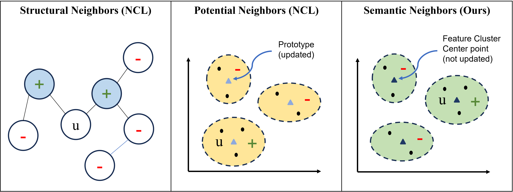

# SCL: Semantic-Enriched Contrastive Learning for Travel Recommendations

> **"Understanding User Preferences through Social Media: Leveraging Semantic-Enriched Contrastive Learning for Enhanced Travel Recommendations"**  
> Heejung Cho, Juyeob Lee, Enric Cervera, Angel P. del Pobil, Eunil Park  
> *Sungkyunkwan University · Jaume I University*

---

## Overview

**SCL (Semantic-Enriched Contrastive Learning)** is a novel graph-based recommendation framework that leverages Instagram data to recommend travel destinations. Building on the NCL structure, SCL introduces a third contrastive learning component using **semantic neighbors** derived from textual social media content (hashtags, captions, geo-tags), enabling the model to capture nuanced user preferences beyond structural graph interactions.

### Key Idea

SCL integrates **three contrastive learning objectives** into GNN-based collaborative filtering:

| Component | Description |
|-----------|-------------|
| **Structural CL** | Contrastive learning between even-layer GNN representations |
| **Potential CL** | Prototype-based contrastive learning via K-means clustering on graph embeddings |
| **Semantic CL** *(ours)* | Contrastive learning using cluster centroids from text-based embeddings (KLUE-RoBERTa) |

<p align="center">
  
</p>

---

## Results

SCL outperforms LightGCN and NCL across all metrics on the Instagram travel dataset (2,009 users, 246 locations, 37,611 interactions).

| Metric | LightGCN | NCL | **SCL** | Improv. over NCL |
|--------|----------|-----|---------|-----------------|
| Recall@5 | 0.3466 | 0.3505 | **0.4017** | +14.6% |
| Precision@5 | 0.1221 | 0.1223 | **0.1515** | +23.9% |
| NDCG@5 | 0.2911 | 0.2896 | **0.3425** | +18.3% |
| MAP@5 | 0.2374 | 0.2343 | **0.2845** | +21.4% |

---

## Repository Structure

```
SCL/
├── configs/              # YAML config files (overall, model-specific, dataset-specific)
│   ├── overall.yaml
│   ├── lightgcn.yaml
│   ├── ncl.yaml
│   ├── scl.yaml
│   └── travel.yaml
├── models/               # Model implementations
│   └── scl.py            # SCL model (main contribution)
├── trainers/             # Trainer implementations
│   └── scl_trainer.py    # SCL trainer
├── scripts/              # Utility scripts
├── travel/               # Dataset directory
├── features/             # Pre-computed semantic feature embeddings
├── run.py                # Main entry point
└── requirements.txt      # Dependencies
```

---

## Installation

```bash
git clone https://github.com/imheejung/SCL.git
cd SCL
pip install -r requirements.txt
```

**Key dependencies:**
- Python 3.8+
- PyTorch 2.5.1
- [RecBole](https://recbole.io/) 1.2.1
- scikit-learn, faiss-cpu

---

## Dataset

We constructed an Instagram-based travel dataset collected via web scraping under the hashtag **#여행스타그램** (travelgram) over 8 months (December 2022 – August 2023).

| Statistic | Value |
|-----------|-------|
| Users | 2,009 |
| Locations (South Korea cities) | 246 |
| Interactions | 37,611 |
| Collection period | Dec 2022 – Aug 2023 |

> ⚠️ **Data availability:** The raw dataset is not included in this repository due to privacy considerations. The dataset is available from the corresponding author upon reasonable request. See the paper for details.

**Semantic features** were generated using [KLUE-RoBERTa](https://github.com/KLUE-benchmark/KLUE) on combined post body text, hashtags, and geo-tags. Pre-computed embeddings are provided in the `features/` directory.

---

## Usage

### Train SCL

```bash
python run.py --model scl --dataset travel
```

### Train baselines

```bash
# LightGCN
python run.py --model lightgcn --dataset travel

# NCL
python run.py --model ncl --dataset travel
```

### Options

```bash
python run.py \
  --model scl \
  --dataset travel \
  --seed 42 \
  --exp_name my_experiment
```

| Argument | Default | Description |
|----------|---------|-------------|
| `--model` | `scl` | Model to run: `lightgcn`, `ncl`, `scl` |
| `--dataset` | `travel` | Dataset name |
| `--seed` | `None` | Random seed for reproducibility |
| `--exp_name` | `''` | Experiment name for result file |
| `--config` | `''` | Path to additional config YAML |

Results are saved to `results/<model>_<exp_name>_seed<seed>.json`.

---

## Configuration

Hyperparameters are managed via YAML files in `configs/`. Key SCL hyperparameters:

---

## Citation

If you find this work useful, please cite:

```bibtex
@article{cho2026understanding,
  title={Understanding user preferences through social media: leveraging semantic-enriched contrastive learning for enhanced travel recommendations},
  author={Cho, Heejung and Lee, Juyeob and Cervera, Enric and del Pobil, Angel P and Park, Eunil},
  journal={Behaviour \& Information Technology},
  pages={1--11},
  year={2026},
  publisher={Taylor \& Francis}
}
```

> 📄 Paper link: https://doi.org/10.1080/0144929X.2026.2678385

---
